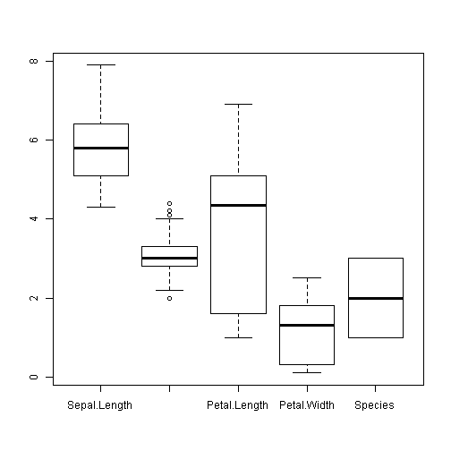
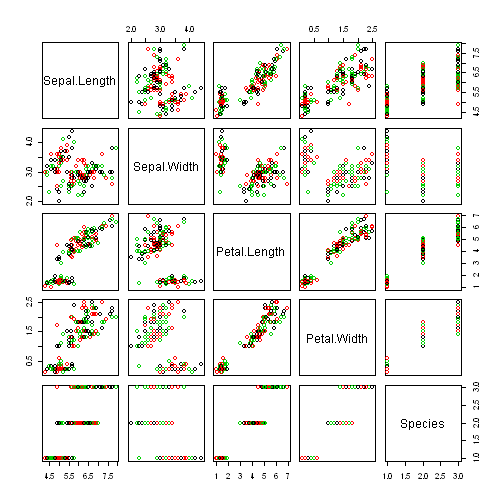

Analysis of iris Data
=====================

## open iris data

```r
  data(iris);
  head(iris);
```

```
##   Sepal.Length Sepal.Width Petal.Length Petal.Width Species
## 1          5.1         3.5          1.4         0.2  setosa
## 2          4.9         3.0          1.4         0.2  setosa
## 3          4.7         3.2          1.3         0.2  setosa
## 4          4.6         3.1          1.5         0.2  setosa
## 5          5.0         3.6          1.4         0.2  setosa
## 6          5.4         3.9          1.7         0.4  setosa
```

```r
  tail(iris);
```

```
##     Sepal.Length Sepal.Width Petal.Length Petal.Width   Species
## 145          6.7         3.3          5.7         2.5 virginica
## 146          6.7         3.0          5.2         2.3 virginica
## 147          6.3         2.5          5.0         1.9 virginica
## 148          6.5         3.0          5.2         2.0 virginica
## 149          6.2         3.4          5.4         2.3 virginica
## 150          5.9         3.0          5.1         1.8 virginica
```

## number of rows and columns of iris data

```r
rows = nrow(iris);
cols = ncol(iris);
print(rows);
```

```
## [1] 150
```

```r
print(cols);
```

```
## [1] 5
```

## inline R-code
Number of rows in iris dataset are 150  and columns are 5.


## number of rows and columns of iris data

```r
boxplot(iris);
```

 

```r
plot(iris, col=1:3);
```

 

